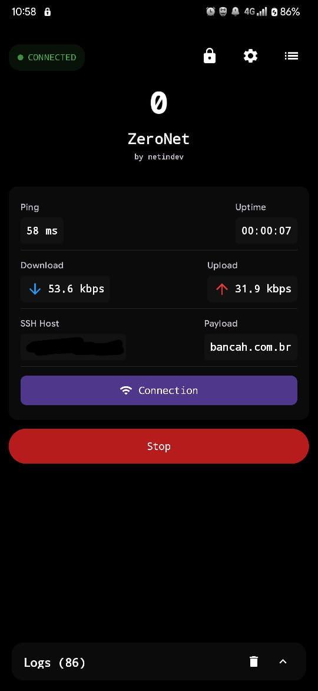

# ZeroNet

## O que é?

Um app que tunela internet por fora usando websites zero-rated da operadora a fim de obter internet ilimitada e gratuita (mesmo sem crédito/dados)

## TODO

- [X] Adicionar suporte TLS
- [X] Adicionar suporte SlowDNS
- [ ] Adicionar suporte V2ray
- [ ] Adicionar suporte Ads Auto-bot

